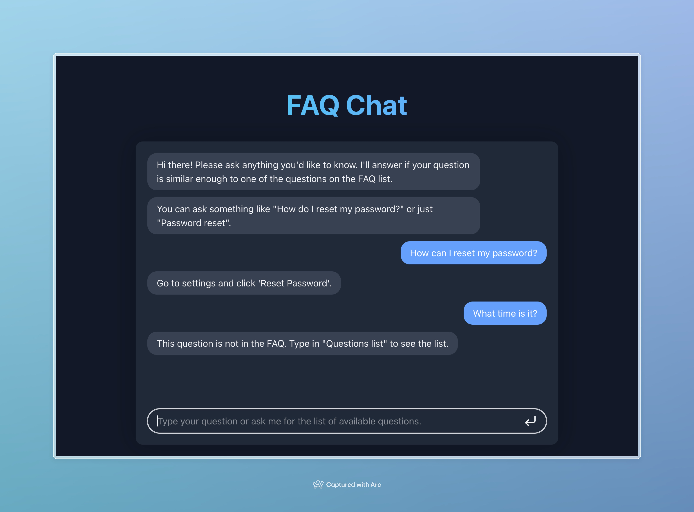

# FAQ Chat

[](https://github.com/kschrute/ai-faq-chat/actions/workflows/ci.yml)

A lightweight, production-ready FAQ question-answering system powered by Retrieval-Augmented Generation (RAG). No model training, no GPU required—just semantic search with pre-trained embeddings.

## Why This Approach?

Unlike traditional chatbots that require fine-tuning language models, this system:
- **Zero Training Required**: Uses pre-trained embeddings and semantic search
- **Instant Updates**: Add new FAQs without retraining models
- **Predictable Responses**: Returns exact FAQ answers or gracefully declines
- **Cost-Effective**: No GPU or expensive API calls needed
- **Fast Setup**: From zero to production in minutes

Perfect for small to medium FAQ datasets (up to ~10,000 questions) where predictable, accurate answers matter more than creative responses.

## Live Demo

The demo is avaialble at [ai-faq-chat.fly.dev](https://ai-faq-chat.fly.dev)



## Prerequisites

- [pnpm](https://pnpm.io)
- [uv](https://astral.sh/uv)

## Getting Started

To install the dependencies run:

   ```shell
   pnpm deps
   ```

And to start the API and the Web app run this after:

```shell
pnpm dev
```

## Updating FAQ

If you update FAQ in the `apps/api/faq.json` file, run the following to rebuild the index:

```shell
pnpm build
```

## Testing the API

You can use `curl` to test the API or use the UI at http://localhost:5173

```shell
curl -X POST http://localhost:8000/chat \
    -H "Content-Type: application/json" \
    -d '{"model": "faq-chat", "messages": [{"role": "user", "content": "How do I reset my password?"}]}'
```

You should see a response like this:

```json
{
  "id": "chatcmpl-...",
  "object": "chat.completion",
  "created": 1768231509,
  "model": "faq-chat",
  "choices": [
    {
      "index": 0,
      "message": {
        "role": "assistant",
        "content": "Go to settings and click 'Reset Password'."
      },
      "finish_reason": "stop"
    }
  ],
  "usage": {
    "prompt_tokens": 0,
    "completion_tokens": 0,
    "total_tokens": 0
  }
}
```

And if you ask something that's not in the FAQ:

```shell
curl -X POST http://localhost:8000/chat \
    -H "Content-Type: application/json" \
    -d '{"model": "faq-chat", "messages": [{"role": "user", "content": "What is quantum computing?"}]}'
```

The response should be:

```json
{
  "id": "chatcmpl-8d069d933415",
  "object": "chat.completion",
  "created": 1768231526,
  "model": "faq-chat",
  "choices": [
    {
      "index": 0,
      "message": {
        "role": "assistant",
        "content": null
      },
      "finish_reason": "stop"
    }
  ],
  "usage": {
    "prompt_tokens": 0,
    "completion_tokens": 0,
    "total_tokens": 0
  }
}
```

### Using with OpenAI SDK

```python
from openai import OpenAI

client = OpenAI(
    base_url="http://localhost:8000",
    api_key="not-needed"  # API key not required
)

response = client.chat.completions.create(
    model="faq-chat",
    messages=[{"role": "user", "content": "How do I reset my password?"}]
)

answer = response.choices[0].message.content
if answer:
    print(f"Answer: {answer}")
else:
    print("No answer found in FAQ")
```

### Using with JavaScript/TypeScript

```typescript
import OpenAI from 'openai';

const client = new OpenAI({
  baseURL: 'http://localhost:8000',
  apiKey: 'not-needed',
});

const response = await client.chat.completions.create({
  model: 'faq-chat',
  messages: [{ role: 'user', content: 'How do I reset my password?' }],
});

const answer = response.choices[0].message.content;
console.log(answer || 'No answer found in FAQ');
```

## Deployment

### Production Build

```shell
pnpm build
```

This creates:
- Optimized frontend bundle in `apps/web/dist/`
- FAISS index and embeddings in `apps/api/`

### Environment Variables

Create a `.env` file in `apps/api/`:

```env
# Optional: Adjust these settings
MODEL_NAME=sentence-transformers/all-MiniLM-L6-v2
SIMILARITY_THRESHOLD=0.85
CORS_ORIGINS=http://localhost:5173,https://yourdomain.com
```

### Docker Deployment

Build and run with Docker:

```shell
docker build -t faq-chat .
docker run -p 8000:8000 -p 5173:5173 faq-chat
```

### Deploy to Fly.io

1. Install Fly CLI:
```shell
curl -L https://fly.io/install.sh | sh
```

2. Deploy:
```shell
fly launch
fly deploy
```

The demo is already deployed at [ai-faq-chat.fly.dev](https://ai-faq-chat.fly.dev)

## Troubleshooting

### Issue: Agent returns `null` for questions that should match

**Symptoms:** Questions that should have answers return `null`

**Solutions:**
- Lower `SIMILARITY_THRESHOLD` in `apps/api/config.py` (try 0.80 or 0.75)
- Check that the question exists in `apps/api/faq.json`
- Verify the index was rebuilt after FAQ changes: `pnpm build`

### Issue: Agent returns wrong answers

**Symptoms:** Questions return answers for different questions

**Solutions:**
- Raise `SIMILARITY_THRESHOLD` in `apps/api/config.py` (try 0.90)
- Review similar questions in FAQ - they may be too similar
- Consider rewording FAQ questions to be more distinct

### Issue: Slow response times

**Symptoms:** Responses take >500ms

**Solutions:**
- Check system resources (CPU, memory)
- Use a smaller embedding model (current: `all-MiniLM-L6-v2`)
- Reduce concurrent request load
- Consider caching frequently asked questions

### Issue: Index build fails

**Symptoms:** `pnpm build` errors or index.faiss not created

**Solutions:**
- Verify `faq.json` is valid JSON
- Check Python dependencies are installed: `cd apps/api && uv sync`
- Ensure sufficient disk space for embeddings
- Try rebuilding: `rm apps/api/index.faiss apps/api/answers.json && pnpm build`

### Issue: Module import errors

**Symptoms:** `ModuleNotFoundError` or import errors

**Solutions:**
- Reinstall dependencies: `pnpm deps`
- Verify uv is installed: `uv --version`
- Check Python version: `python3 --version` (requires 3.11+)

## Architecture

For detailed information about the agent architecture, see [AGENTS.md](./AGENTS.md).

Key architectural decisions:
- **RAG over Fine-tuning**: No model training required, instant updates
- **FAISS**: Fast vector search, memory-efficient, Python-friendly
- **Sentence Transformers**: Pre-trained on similarity tasks, good quality
- **OpenAI API Format**: Compatible with existing tools and SDKs

## Contributing

Contributions are welcome! Please:

1. Fork the repository
2. Create a feature branch: `git checkout -b feature/amazing-feature`
3. Make your changes
4. Run tests: `pnpm test`
5. Run linters: `pnpm lint`
6. Commit your changes: `git commit -m 'Add amazing feature'`
7. Push to the branch: `git push origin feature/amazing-feature`
8. Open a Pull Request

### Development Guidelines

- Follow existing code style (enforced by Biome and Ruff)
- Add tests for new features
- Update documentation as needed
- Keep commits atomic and well-described

## License

ISC License - see LICENSE file for details

## Acknowledgments

- [FAISS](https://github.com/facebookresearch/faiss) by Facebook AI Research
- [Sentence Transformers](https://www.sbert.net/) by UKPLab
- [FastAPI](https://fastapi.tiangolo.com/) by Sebastián Ramírez
- [React](https://react.dev/) by Meta

## Further Reading

- [AGENTS.md](./AGENTS.md) - Detailed agent architecture documentation
- [Retrieval-Augmented Generation Paper](https://arxiv.org/abs/2005.11401)
- [FAISS Documentation](https://github.com/facebookresearch/faiss/wiki)
- [Sentence Transformers Documentation](https://www.sbert.net/docs/)
- [OpenAI Chat Completions API](https://platform.openai.com/docs/api-reference/chat)